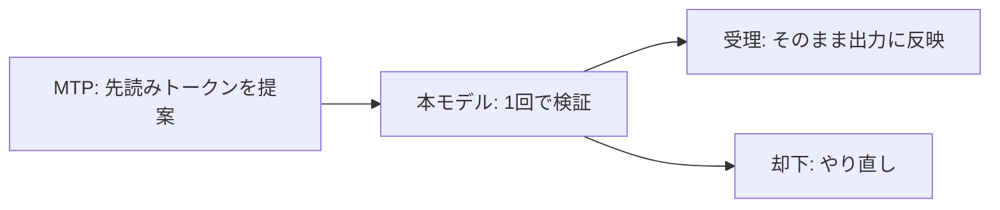

# MTP（投機的デコード）調査レポート

**作成日**: 2026-05-23  
**対象環境**: vllm-manager（backend コンテナ内 vLLM 管理）  
**対象モデル**: `Qwen/Qwen3.6-27B-FP8`  
**vLLM バージョン**: 0.21.0（ログより）

---

## 1. サマリー

| 項目 | 結果 |
|------|------|
| MTP 動作 | ウォームアップ後は正常。ログ上 **Detected MTP model**、drafter ロード確認済み |
| 実効生成速度（安定後） | **約 70 tok/s**（ピーク **約 96 tok/s**） |
| 以前の体感（約 50 tok/s）との比較 | 安定後 **約 1.4〜1.6 倍**（+40〜60%）、好調時 **約 1.8〜1.9 倍** |
| 受理率の影響 | 0% → **75〜85%** に上がると generate tok/s が大きく改善 |
| 起動時の設定エラー | `rejection_sample_method: strict` は vLLM 0.21 非対応 → `standard` に正規化済み |

---

## 2. 調査目的

- MTP 有効時の **generate tok/s** とログの **Accepted / Drafted** の意味を整理する
- 体感 **約 50 tok/s** からどの程度速くなったか、**受理率** を踏まえて見積もる
- 安定稼働までに時間がかかる理由（ウォームアップ）を記録する

---

## 3. 調査時の MTP 設定

```json
{
  "speculative_config": {
    "method": "mtp",
    "num_speculative_tokens": 2,
    "rejection_sample_method": "standard",
    "draft_tensor_parallel_size": 1,
    "max_model_len": 8192
  }
}
```

| 項目 | 備考 |
|------|------|
| `method` | UI の `qwen3_next_mtp` は vLLM 内部で `mtp` に変換（非推奨警告のみ） |
| `num_speculative_tokens` | 2。vLLM 警告どおり、大きすぎると受理率低下の可能性あり |
| `rejection_sample_method` | vLLM 0.21 は **`standard` / `synthetic` のみ** 有効 |

### 起動時にあった設定エラー（MTP 関連）

`rejection_sample_method: strict` 指定時、起動直後に ValidationError で失敗:

```text
rejection_sample_method
  Input should be 'standard' or 'synthetic'
  input_value='strict'
```

**対応**: `app/server_manager.py` で `strict` / `probabilistic` → `standard` に正規化。UI も `standard` / `synthetic` のみに変更済み。

---

## 4. ログの見方

`/app/data/vllm.log` に **10 秒間隔**で出力される。

### 4.1 実効速度（体感に近い）

```text
Avg generation throughput: 96.2 tokens/s
```

**クライアントに返しているトークンの速度**。ここが「generate の tok/s」。

### 4.2 MTP 専用メトリクス

```text
SpecDecoding metrics: Mean acceptance length: 2.66,
  Accepted throughput: 60.09 tokens/s,
  Drafted throughput: 72.19 tokens/s,
  Avg Draft acceptance rate: 83.2%
```

| 指標 | 意味 |
|------|------|
| **Drafted throughput** | MTP が「たぶんこう」と提案したトークン量／秒 |
| **Accepted throughput** | 本モデルの検証で **そのまま採用**されたトークン量／秒（＝受理の速度） |
| **Avg Draft acceptance rate** | 提案の何％が採用されたか（命中率） |
| **Mean acceptance length** | 1 回の検証で平均何トークンまとめて受理できたか |

### 4.3 3 つの速度の関係

```text
実効 generate tok/s  ≈  Accepted  +  却下分の再生成
```

- **Accepted** が大きいほど MTP が効いている
- **受理率が低い**と Drafted だけ増えて generate は伸びない

---

## 5. 稼働フェーズ（同一セッション）

| フェーズ | generate tok/s | 受理率 | 状態 |
|----------|----------------|--------|------|
| ウォームアップ | 4〜12 | 0% | Triton JIT 等。MTP 提案はすべて却下 |
| 移行期 | 25〜50 | 10〜30% | 「以前 50 前後」の記憶に近い区間 |
| **安定稼働** | **70〜96**（平均 **約 70**） | **75〜85%** | MTP が本番モードで効いている |

ログ抜粋（安定後の例）:

```text
Avg generation throughput: 96.2 tokens/s
SpecDecoding metrics: ... Accepted throughput: 60.09 tokens/s,
  Drafted throughput: 72.19 tokens/s, Avg Draft acceptance rate: 83.2%
```

---

## 6. 集計値

`vllm.log` 1 セッション分を集計（2026-05-22 時点）。

| 指標 | 全体平均 | 安定時（受理率 > 10%） |
|------|----------|------------------------|
| **generation tok/s** | 約 55 | **約 70**（最大 約 96） |
| **Accepted tok/s** | 約 41 | 約 40〜60 |
| **Drafted tok/s** | 約 52 | 約 50〜72 |
| **受理率** | — | **約 74〜85%**（中央値 約 79%） |
| **Mean acceptance length** | — | **約 2.5〜2.7** |

---

## 7. 50 tok/s からどの程度早いか

### 7.1 単純比較

| 基準 | generate tok/s | 倍率 |
|------|----------------|------|
| 以前の体感 | **約 50** | 1.0x |
| MTP 安定後（平均） | **約 70** | **約 1.4x（+40%）** |
| MTP 安定後（好調） | **約 90〜96** | **約 1.8〜1.9x（+80〜90%）** |

### 7.2 受理率で見ると

| 状況 | generate | 受理率 | Accepted（目安） |
|------|----------|--------|------------------|
| 移行期（50 前後） | 約 50 | 約 20% | 約 10 tok/s |
| 安定後 | 約 75 | 約 80% | 約 50〜60 tok/s |

**体感の 1.5 倍加速**は、主に **受理率が上がり MTP の先読みが当たるようになったこと**で説明できる。

理論上は `num_speculative_tokens=2` かつ受理長 2.5 付近で、もう少し伸びる余地もあるが、却下後の再計算・長い prefill・ツール呼び出し等で **実測 1.4〜1.6 倍**程度に落ち着くのは妥当。

### 7.3 MTP 無効時との厳密比較

同一プロンプトで **speculative OFF / ON** を流し、`Avg generation throughput` を比較するのが最も正確。本レポートの 50 tok/s は移行期ログとユーザー体感に基づく参照値。

---

## 8. MTP の処理フロー



`num_speculative_tokens=2` のとき、うまくいけば 1 回の検証で最大 2 トークン分をまとめて進められる。

---

## 9. 推奨運用

1. **起動後 数分はウォームアップ**とみなす。受理率 0%・generate 十数 tok/s は異常ではない
2. 本番判断は **受理率 70% 以上**かつ **generate 60 tok/s 以上**が安定してから
3. `num_speculative_tokens` は **1 から試し**、受理率を見て 2 に上げる
4. ログ確認:

```bash
docker exec vllm-manager-backend grep -E "generation throughput|SpecDecoding" /app/data/vllm.log | tail -20
```

---

## 10. 制約・免責

- 数値は **1 セッションの `vllm.log`** に基づく。backend 再起動でログはリセットされる
- `request_history.jsonl` の `gen_tok_s`（リクエスト単位）はエンジン集計と計測方法が異なり、本レポートでは参照していない
- prefill 速度（`Avg prompt throughput` の 4000+ tok/s）は別指標。生成速度の比較には `generation throughput` を使う

---

**関連ドキュメント**: [サーバー起動オプション（speculative_config）](./server-start-options.md)
